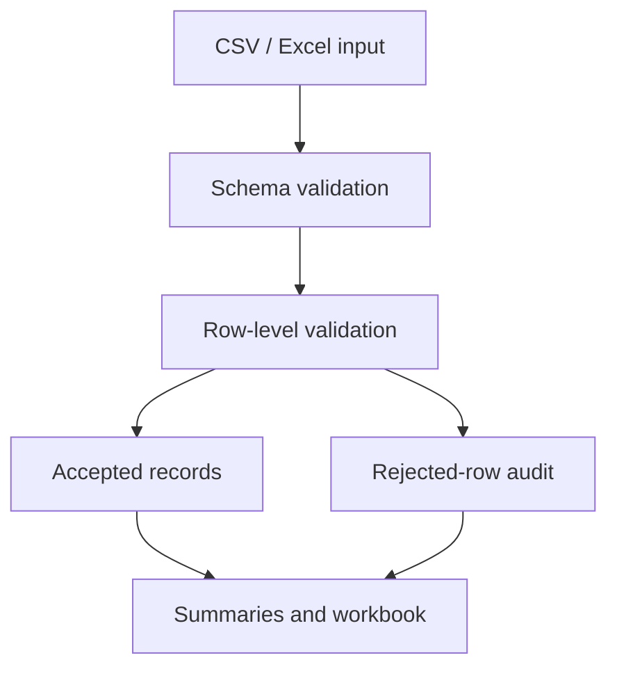

# Excel / CSV Reporting Automation

[](https://github.com/farshidghaffari/excel-csv-report-automation/actions/workflows/tests.yml)

**Supporting implementation · Data processing and reporting · Python / Pandas / OpenPyXL**

A reusable data-to-report workflow that validates CSV or Excel input, separates accepted and rejected records, calculates revenue metrics, and produces a traceable, business-readable Excel workbook.

## Business Problem

Recurring operational reports are often assembled through repeated spreadsheet work: importing source files, renaming columns, correcting values, calculating totals, grouping data, and rebuilding the same summary tabs every week or month.

The risk is not limited to wasted time. Invalid dates, malformed quantities, missing product details, and negative prices can silently distort a report when the workflow does not make data-quality decisions visible.

This implementation turns that repeatable work into an explicit processing pipeline. Valid records proceed to reporting; invalid records remain traceable with their source row and rejection reason.

## Implemented Workflow



The workflow:

- Reads `.csv`, `.xlsx`, and legacy `.xls` input files
- Normalizes column names to a consistent lowercase format
- Detects missing required columns
- Rejects columns that collide after normalization
- Validates dates, product and category values, quantities, and unit prices
- Requires whole-number quantities greater than zero
- Allows zero-valued prices but rejects negative or non-numeric prices
- Preserves each rejected record with its source row and one or more rejection reasons
- Calculates revenue only from accepted records
- Builds monthly, category, and product summaries
- Generates processing metrics for accepted and rejected rows
- Exports a formatted six-sheet `.xlsx` workbook

## Required Input Schema

| Column | Rule | Purpose |
|---|---|---|
| `date` | Required and parseable | Transaction or order date |
| `product` | Required and non-empty | Product name |
| `category` | Required and non-empty | Reporting category |
| `quantity` | Whole number greater than zero | Number of units |
| `unit_price` | Numeric and zero or greater | Price per unit |

Example input:

```csv
date,product,category,quantity,unit_price
2026-01-05,USB Cable,Accessories,5,8.5
2026-01-07,Wireless Mouse,Accessories,2,24.9
```

If a required column is absent, or two headings become identical after normalization, the workflow stops with a clear `ValueError` rather than producing an ambiguous report.

## Row-Level Failure Handling

Invalid records are not converted to zero or silently discarded. They are written to the `Rejected Rows` worksheet with:

- The original normalized input values
- The corresponding `source_row` from the source file
- A readable `rejection_reason`
- Multiple reasons when more than one rule fails

Examples include:

```text
invalid or missing date
missing product
invalid or missing quantity
quantity must be greater than zero
quantity must be a whole number
unit price cannot be negative
```

This creates a clear boundary between automated processing and records that require correction or review.

## Generated Workbook

| Worksheet | Contents |
|---|---|
| `Cleaned Data` | Accepted rows with source row, normalized values, revenue, and reporting month |
| `Rejected Rows` | Invalid rows with source row and explicit rejection reasons |
| `Monthly Summary` | Quantity, revenue, average unit price, and order count by month |
| `Category Summary` | The same metrics grouped by category |
| `Product Summary` | The same metrics grouped by product |
| `Report Info` | Source file, input/accepted/rejected counts, total revenue, and date range |

Every worksheet receives a styled header, frozen first row, practical column widths, and filtering where data rows are present. Revenue and price columns use consistent number formatting.

## Quick Start

### 1. Clone the repository

```bash
git clone https://github.com/farshidghaffari/excel-csv-report-automation.git
cd excel-csv-report-automation
```

### 2. Create and activate a virtual environment

```bash
python -m venv .venv
```

Windows:

```bash
.venv\Scripts\activate
```

macOS / Linux:

```bash
source .venv/bin/activate
```

### 3. Install dependencies

```bash
python -m pip install -r requirements.txt
```

### 4. Run the included demonstration

```bash
python examples/run_demo.py
```

The generated workbook will be saved to:

```text
output/sales_report.xlsx
```

## Testing and Continuous Integration

Run the complete test suite locally with:

```bash
python -m pytest -q
```

GitHub Actions runs the suite automatically on Python 3.10, 3.11, and 3.12 for every push and pull request to `main`.

The current tests verify:

- Creation and structure of the six-sheet workbook
- Revenue calculations and processing metrics
- Rejected-row auditing and source-row traceability
- `.xlsx` input processing
- Missing-column failure
- Duplicate normalized-column failure
- Unsupported input-type failure
- Enforcement of an `.xlsx` output file

## Reliability Decisions

- **Schema validation happens before reporting.** Required fields must exist before row processing begins.
- **Invalid records remain visible.** Rejected rows are separated with actionable reasons instead of being silently lost.
- **Revenue uses accepted records only.** Invalid values cannot be coerced into report totals.
- **Input and output formats fail explicitly.** Supported source formats and the required `.xlsx` output are enforced.
- **Source data is not modified in place.** The workflow writes a separate report file.
- **Report structure is deterministic.** The same valid schema produces the same worksheets and summary dimensions.
- **Empty accepted datasets remain safe.** Metadata and worksheets are still generated without date-range failures.

## Current Boundaries

This is a focused supporting implementation rather than a complete reporting platform.

- Required columns, validation rules, and summary dimensions are configured in code.
- Rejected rows are documented but are not automatically corrected or routed to a review queue.
- CSV reading currently assumes conventional comma-delimited input and standard Pandas-compatible encoding.
- The workflow runs locally and does not yet include scheduling, notifications, storage integrations, or a web interface.
- Business-specific tax, currency, timezone, and accounting rules must be defined before production adaptation.

These boundaries are explicit so the repository demonstrates implemented behavior without presenting planned features as completed work.

## Adaptation Paths

The same workflow pattern can be adapted for:

- Sales and revenue reporting
- Inventory and purchasing summaries
- Client order exports
- Finance and operational reports
- Data preparation before dashboard ingestion
- Scheduled weekly or monthly reporting
- Human-review workflows for rejected records

## Repository Structure

```text
excel-csv-report-automation/
├── .github/workflows/
│   └── tests.yml
├── examples/
│   └── run_demo.py
├── sample_data/
│   └── sales_sample.csv
├── src/report_automation/
│   ├── __init__.py
│   └── generate_report.py
├── tests/
│   └── test_generate_report.py
├── docs/
├── output/
├── requirements.txt
└── README.md
```

## Related Links

- [Portfolio projects](https://farshidghaffari.net/projects/)
- [Reporting automation insight](https://farshidghaffari.net/insights/reliable-reporting-automation/)
- [Discuss a reporting workflow](https://farshidghaffari.net/contact/)

## Author

**Farshid Ghaffari**

Business Automation & Integration Specialist

AI Workflows · APIs · Backend Systems
