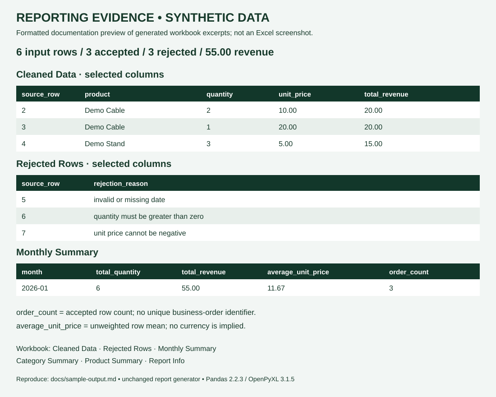

# Synthetic Workbook Evidence

All values in this example are synthetic. No customer records, private source files, or real financial results are used. The amounts have no implied currency.

## Reproduce with the existing implementation

From the repository root after installing the declared dependencies:

```bash
PYTHONPATH=src python -c "from report_automation.generate_report import generate_report; generate_report('sample_data/sales_validation_synthetic.csv', 'output/synthetic_validation_report.xlsx')"
```

On Windows, set `PYTHONPATH` to `src` in your shell before running the Python command. Keep output distinct from input. The original `python examples/run_demo.py` demonstration remains available and uses `sales_sample.csv`.

Evidence generated with Pandas 2.2.3 and OpenPyXL 3.1.5, using the unchanged generator from commit `4bd042dd11a966e7afce5a43c43d8b4fae3a9b0b`. This fixture covers a few rules, not every edge case.

## All six sheets

| Sheet | Verified contents for this fixture |
|---|---|
| Cleaned Data | 3 accepted rows, source positions 2–4, normalized values, revenue, month |
| Rejected Rows | 3 rows, source positions 5–7, original parsed values and reasons |
| Monthly Summary | January: quantity 6, revenue 55.00, average_unit_price 11.67, order_count 3 |
| Category Summary | Accessories: quantity 3, revenue 40.00, mean 15.00, count 2; Office: quantity 3, revenue 15.00, mean 5.00, count 1 |
| Product Summary | Demo Cable: quantity 3, revenue 40.00, mean 15.00, count 2; Demo Stand: quantity 3, revenue 15.00, mean 5.00, count 1 |
| Report Info | source_file, input_rows 6, accepted_rows 3, rejected_rows 3, total_revenue 55.00, date_from 2026-01-05, date_to 2026-01-07 |

## Accepted and rejected records

| Parsed source_row | Outcome | Revenue or reason |
|---|---|---|
| 2 | Accepted | 2 × 10 = 20 |
| 3 | Accepted | 1 × 20 = 20 |
| 4 | Accepted | 3 × 5 = 15 |
| 5 | Rejected | invalid or missing date |
| 6 | Rejected | quantity must be greater than zero |
| 7 | Rejected | unit price cannot be negative |

A row can have multiple reasons joined with `; `. Rejected rows do not contribute to summaries and are not automatically repaired. The sheet name `Cleaned Data` means normalized accepted records.

## Interpretation

`order_count = 3` means three accepted line items, not three established unique orders. No order ID is present. `average_unit_price = (10 + 20 + 5) / 3 = 11.67`; it is not quantity-weighted (`55 / 6 = 9.17`) and not average order value. No metric semantics have been changed.

`source_row` is parsed-record position plus a header offset. It aligns with this simple CSV but is not guaranteed to equal physical line numbers when blank lines or multiline records exist. “Original” rejected values mean values after parsing and heading normalization, not byte-for-byte preservation.

## Preview



The SVG is a formatted documentation preview transcribed from the generated workbook, not an Excel screenshot. It shows selected columns from three sheets; the table above records all six. The workbook itself is generated locally and is not committed.

## Verification performed

Generated the workbook using the unchanged application; inspected all six sheets, accepted/rejected rows, group totals, and Report Info. Existing tests remain unchanged. This evidence does not establish production suitability or comprehensive validation.
